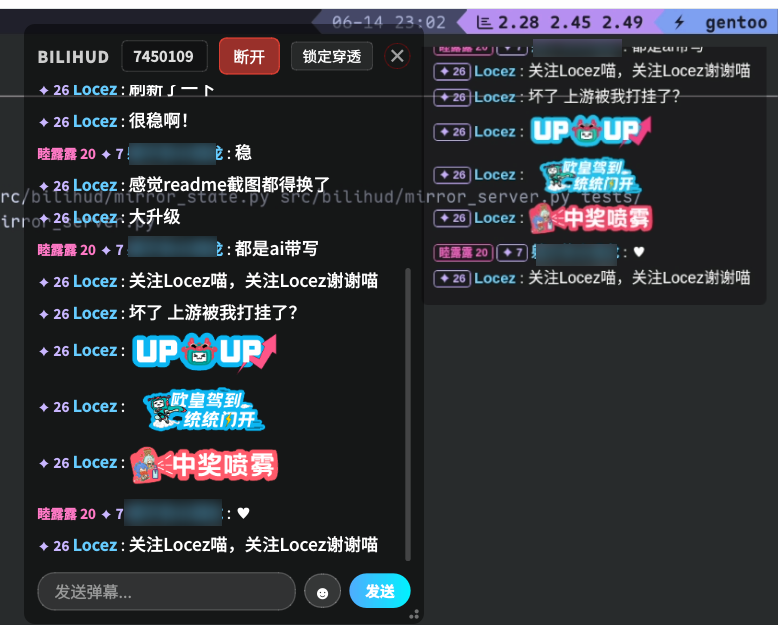

# B站弹幕阅读器 (bilihud)


[](https://opensource.org/licenses/MIT)

一个基于PyQt6和blivedm的B站弹幕阅读器，可以在Linux KDE环境下全屏游戏时显示弹幕。

> [!NOTE]
> 本项目基于 **Vibe Coding**（氛围驱动编码）模式开发，旨在快速实现创意与功能。目前仅在有限环境下进行过测试，未做大量的严谨验证。如有 Bug，欢迎反馈！

## 效果预览

### 一般模式 (Normal)


### 游戏穿透模式 (Pass-through)


### 直播控制与 OBS 推流


## 功能特点

* 实时显示B站直播间弹幕
* 半透明overlay窗口，可在游戏全屏时显示
* 美观的UI界面，支持不同用户等级的颜色标识
* 支持连接/断开直播间
* 显示用户名、粉丝牌等级、财富/荣耀等级和大航海标识
* 支持发送弹幕
* 支持读取并显示 B 站弹幕表情，包括纯表情和行内表情
* 支持发送直播间表情，自动读取当前直播间可用表情包并标识未解锁表情
* 支持 BiliHUD Mirror，可将 HUD 弹幕内容通过本地网页同步给 OBS 浏览器源或其他采集工具
* 支持扫码登录
* 支持直播控制：读取历史标题和当前分区，更新标题/分区，开始/停止直播并展示 RTMP/SRT 推流凭证
* 支持 OBS WebSocket 联动：检查/启动 OBS，开播后自动填入 RTMP 地址和密钥并触发 OBS 开始推流
* **注意：** 使用 layer-shell-qt 支持 wayland 环境

## Wayland 支持范围

BiliHUD 的全屏浮窗能力依赖 compositor 支持 `wlr-layer-shell` 协议。

* KDE Plasma Wayland / KWin：预期支持全屏应用上方浮窗。
* wlroots 系 compositor：如 compositor 提供 `wlr-layer-shell`，预期可用。
* GNOME Wayland / Mutter：不支持 `wlr-layer-shell`，因此不支持全屏应用上方浮窗，也不保证普通窗口置顶。BiliHUD 会回退为普通窗口，仍可在桌面环境中移动和使用。

## 极速上手

### 1. 安装

#### 系统依赖 (System Dependencies)

由于引入了 `layer-shell-qt`，如果您从源码运行，请先根据您的发行版安装必要的依赖：

**Ubuntu / Debian:**
```bash
sudo apt install liblayershellqtinterface-dev build-essential libwayland-dev qt6-base-dev libqt6waylandclient6
```

**Fedora:**
```bash
sudo dnf install gcc-c++ qt6-qtbase-devel layer-shell-qt-devel wayland-devel
```

**Arch Linux:**
```bash
sudo pacman -S qt6-base qt6-wayland layer-shell-qt
```

**Gentoo Linux:**
```bash
sudo emerge -a kde-plasma/layer-shell-qt dev-qt/qtwayland
```

#### 通用步骤

```bash
# 1. 克隆仓库
git clone https://github.com/locez/bilihud.git
cd bilihud

# 2. 初始化子模块 (blivedm)
git submodule update --init --recursive

# 3. 环境配置与安装 (推荐使用 uv)
# 安装 uv
pip install uv

# 创建虚拟环境并同步依赖
uv sync

# 激活环境
source .venv/bin/activate
```

### 2. 启动

```bash
uv run bilihud
```

### 3. 开播与 OBS 推流

在托盘图标右键菜单中选择"直播控制"即可打开开播窗口。首次使用前请先通过"扫码登录"完成 Bilibili 登录，否则无法获取开播所需的 CSRF Token。

开播窗口会自动读取直播间历史标题和当前分区。您可以直接修改标题，或在分区输入框中搜索并选择目标分区；点击"开始直播"后，BiliHUD 会调用 Bilibili 开播接口并在下方显示 RTMP/SRT 地址和密钥。若开播需要扫码验证或人脸认证，窗口会弹出对应验证入口，完成后再次点击"开始直播"即可。

如果需要联动 OBS，请在 OBS 中启用 WebSocket 服务，并在开播窗口填写 OBS 地址、端口和密码。OBS 28 及以上版本内置 WebSocket，默认端口通常为 `4455`。点击"检查 OBS"确认可连接后，再点击"开始直播"，BiliHUD 会把 RTMP 推流地址和密钥写入 OBS 并触发 OBS 开始推流。

如果 OBS 未配置、WebSocket 不可连接或自动推流失败，开播成功后仍会显示推流地址和密钥，您可以手动复制到 OBS 中使用。

### 4. 表情功能

BiliHUD 会读取弹幕中的 B 站表情信息，并在 HUD 和 Mirror 中显示对应图片。普通文字弹幕仍会按原样显示。

登录后，弹幕输入框右侧会显示表情按钮。点击后会拉取当前直播间可发送的表情包，包括通用表情、UP 主大表情和房间专属表情；未解锁的表情会置灰且不可发送。表情包列表会短暂缓存，避免频繁点击时重复请求 B 站接口。

### 5. BiliHUD Mirror

BiliHUD Mirror 会在本机启动一个只读网页，将 HUD 弹幕内容同步渲染出来，适合添加到 OBS 浏览器源中，让观众也能看到弹幕内容。

在托盘图标右键菜单中选择 "BiliHUD Mirror" 可以启用或关闭 Mirror，并查看当前 URL。默认地址为：

```text
http://127.0.0.1:2233/bilihud-mirror
```

OBS 中添加 "浏览器" 源后，将 URL 填为上面的 Mirror 地址。推荐初始尺寸：

```text
宽度：400
高度：300
```

Mirror 默认仅监听 `127.0.0.1`，用于本机浏览器源或本机浏览器访问。

## 隐私说明 & 配置

### 自动登录 (Cookies)

为了提供完整的体验（如显示完整用户名、发送弹幕、显示舰长标识），**BiliHUD** 会尝试自动读取本地浏览器的 Bilibili 登录状态。

*   **读取范围**: 程序仅读取 `.bilibili.com` 域下的 Cookies。
*   **读取目的**: 获取 `SESSDATA` 和 `bili_jct` (CSRF Token) 仅用于与 Bilibili API 进行必要的身份验证。
*   **支持浏览器**: Chrome, Edge, Firefox。
*   **数据安全**: 您的 Cookies 仅在本地内存中使用，**绝不会**被发送到任何第三方服务器。

**注意：** **BiliHUD** 默认会尝试自动读取本地浏览器的 Bilibili 登录状态，如果无法读取，您可以在托盘图标右键菜单中选择"扫码登录"来启用扫码登录功能。


## 打包与发行 (Packaging)

### Arch Linux

本项目已发布至 AUR ([bilihud-git](https://aur.archlinux.org/packages/bilihud-git))。推荐使用 `paru` 或其他 helper 快速安装：

```bash
paru -S bilihud-git
```

此外，`packaging/arch/PKGBUILD` 提供了本地打包的示例文件。

### Gentoo Linux

如果您是 Gentoo 用户，相关包已包含在 [我的个人 overlay](https://github.com/locez/locez-overlay) 中，添加后即可安装。

本地 ebuild 示例文件位于: `packaging/gentoo/`

## 鸣谢

* [blivedm](https://github.com/xfgryujk/blivedm) - B站直播弹幕协议库
* [PyQt6](https://pypi.org/project/PyQt6/) - Python GUI框架
* [qasync](https://github.com/CabbageDevelopment/qasync) - PyQt6与asyncio集成库
